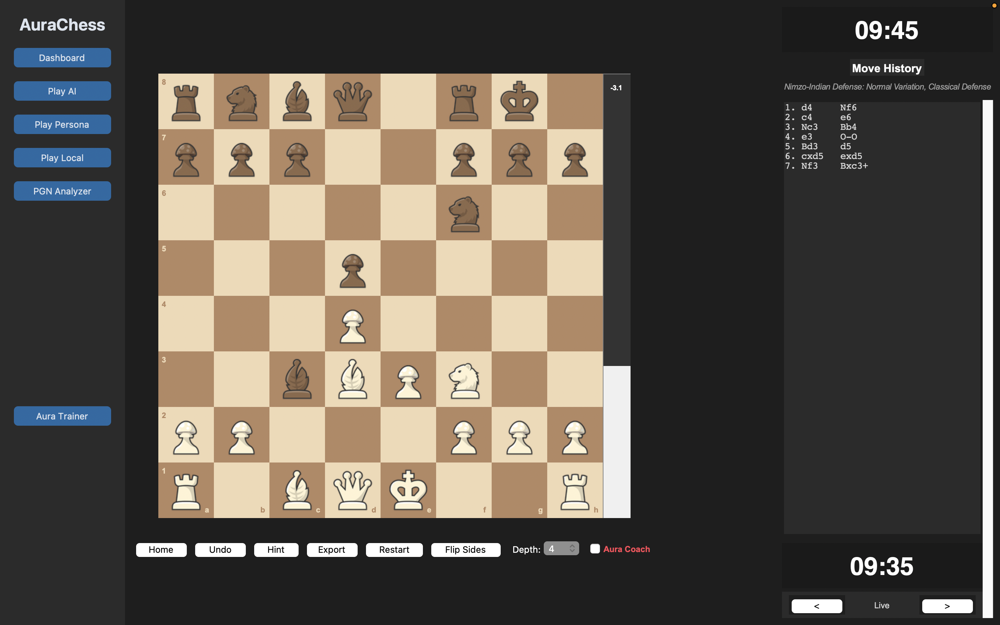

# AuraChess (v3.0)

**Created by Abdulazizxon Saydaliyev**

A fully-functional, ultra-fast Python chess engine powered by Cython C-extensions, integrated with a Spaced Repetition Aura Auto-Trainer.



## Features

###  Aura Auto-Trainer (Spaced Repetition)
The app features an offline Spaced Repetition engine that mines your actual game history and tests you on your blunders.
* **The Intelligence Miner**: Downloads your recent games from Chess.com and cross-references your opening moves against the offline `komodo.bin` Grandmaster Opening Book.
* **Personalized Flashcards**: Automatically detects if you play a move that violates Grandmaster theory, isolating that exact position and generating a personalized flashcard.
* **Spaced Repetition Hub**: Drops you right into the exact position on the board where you previously made a mistake. You are forced to figure out the *correct* Grandmaster move to advance.

### ⚡ Cython-Optimized Core
* The engine's core math logic is statically typed and compiled into C (`.so` extensions) for massive performance gains, effortlessly supporting search depths from 1 to 8.
* **Algorithmic Intelligence**: Implements Alpha-Beta Negamax search, MVV-LVA move ordering, and Quiescence Search to prevent horizon-effect blunders.
* **Positional Mastery**: Uses PeSTO's Piece-Square Tables for strong positional and developmental understanding.

###  Modern Dashboard GUI
* Built natively in `customtkinter` with a dark mode, premium aesthetic.
* **PGN Analyzer**: Paste PGNs to analyze games against the Cython engine.
* **Move History & Real-Time Eval**: Scrollable history with standard algebraic notation and dynamic evaluation bars showing real-time engine advantage.
* **Aura Coach**: Real-time blunder prevention during games that triggers UI warnings when you make a game-losing move.

## Prerequisites
* Python 3.8+
* A C-Compiler (like Apple Clang or GCC) to compile the Cython extensions
* Native macOS/Linux/Windows support

## Installation

1. Clone the repository and navigate to the project directory:
   ```bash
   cd chess-engine
   ```

2. Create and activate a Python virtual environment:
   ```bash
   python3 -m venv venv
   source venv/bin/activate  # On Windows use: venv\Scripts\activate
   ```

3. Install the required dependencies:
   ```bash
   pip install -r requirements.txt
   ```

4. Compile the engine into C-extensions:
   ```bash
   python3 setup.py build_ext --inplace
   ```

## Running the App

To launch the full AuraChess dashboard:
```bash
python3 aurachess.py
```

To update your Spaced Repetition flashcards with your latest games:
```bash
python3 theory_analyzer.py
```
